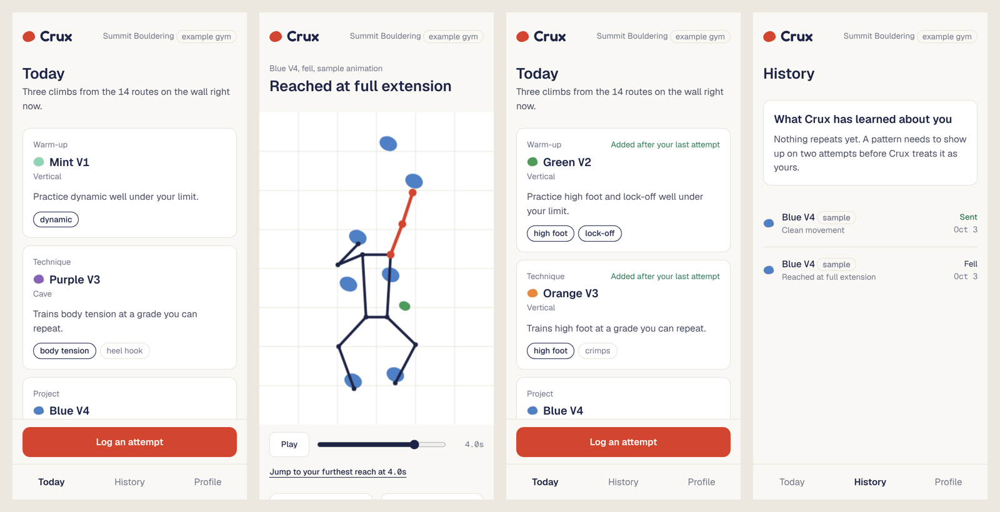

# Crux

**Personal coaching for every member of a climbing gym, built from the routes
on the wall right now and fitted to the climber's body.**

Most gym members want to get better and almost none get coached. A private
lesson costs $60 to $99 an hour, generic training apps have never seen the
gym's wall, and beta from taller climbers often doesn't work for shorter ones.
"Just reach for it" is not advice when you can't reach it.

Crux builds each climber a session from their gym's current routes, measures
their movement from a video of an attempt, and gives feedback that fits their
height and span.



## How it works

1. **A session from the wall.** Crux picks three live routes: a warm-up, a
   technique route, and a project. It weighs what you said you want to work on
   and, more heavily, what it has measured in your attempts.
2. **Film an attempt.** Pose tracking runs in your browser and follows your
   shoulders, elbows, hips, knees and feet through the clip. The video is not
   uploaded.
3. **Measured feedback.** Crux finds the moment you reached furthest and
   measures it: "At 4.0s your arm was straight (177°) with both feet still
   low." Every piece of feedback points to a number and a moment.
4. **Beta for your body.** If a route's longest move is more than 93% of your
   arm span, Crux says so and shows the beta written for your height.
5. **The next session adapts.** Reach at full extension twice and your
   sessions shift toward high-foot and lock-off routes.

Feedback comes from measurements and fixed rules. There is no language model
writing coaching advice.

## Try it

```bash
npm install
npm run dev        # http://localhost:3000
```

Enter 5'0", V3, and the focus areas "Steep body tension" and "Dynamic moves".
Then choose **Log an attempt → Try a sample → Fall at the crux**. The two
sample attempts are animated figures that run through the same analysis as a
real clip, so you can see the whole loop without filming anything.

To analyze your own climb, film from behind with your whole body in frame and
choose the clip. The first analysis downloads the pose model, which takes a
few seconds.

## What is built

The [spec](docs/CRUX_SPEC.md) defines six milestones. This repo has the first two.

| Milestone | Status |
|-----------|--------|
| 1. Logic and tests: reach, session builder, attempt analysis, coach flags | Done |
| 2. Climber app: onboarding, today, attempt with pose tracking, history, profile | Done |
| 3. Accounts and data (Supabase) | Next |
| 4. Coach: flags, roster, notes, shared clips | Planned |
| 5. Setter: route tagging, beta per height band, wall reset | Planned |
| 6. Gym admin: members and revenue | Planned |

Until milestone 3, everything a climber enters is stored in their browser.
The gym, its 14 routes, and the beta library are seed data, and the app labels
them as examples wherever they appear.

## The rules, in code

The logic lives in `lib/` as plain TypeScript with no framework in it, so it
is unit tested and can be reused in a mobile app later.

| File | What it decides |
|------|-----------------|
| `lib/reach.ts` | Arm span, what counts as a long reach, beta by height band |
| `lib/session.ts` | Which three routes make today's session, and why |
| `lib/analysis.ts` | Furthest reach, elbow angle, high foot, bent-arm share, from pose landmarks |
| `lib/feedback.ts` | The sentence shown for each finding |
| `lib/flags.ts` | When a coach should look at a climber |
| `lib/samples.ts` | The two sample attempts, generated as pose frames |

```bash
npm test           # 54 unit tests
npm run lint
npm run build      # static export in out/
```

## Tech

Next.js (App Router) with TypeScript in strict mode, Tailwind CSS with the
design tokens as CSS variables, MediaPipe Pose Landmarker for in-browser pose
tracking, and Vitest. The build is a static export, so it can be hosted
anywhere.

## Decisions and limits

- **One climber, filmed from behind, clips up to 45 seconds.** Bouldering only.
- **Not yet tested on real climbing footage.** The analysis is verified on the
  sample attempts and synthetic poses. Real clips will need the thresholds
  checked against how coaches would call them.
- **The pose model loads from Google's servers.** The tracking code is served
  from this site and the video stays on the device, but the model file itself
  is downloaded on first use.
- **One departure from the spec's tokens.** The light theme's muted text is
  `#6F7489`, not `#8A8FA3`, so small text meets the spec's own 4.5:1 contrast
  rule.
- **Open questions from the spec** that this build answers provisionally: the
  product is called "Crux" throughout, and clips are chosen from the device
  rather than recorded in the app.

## Design

Near-monochrome, one accent, hairline borders, measurements in a mono face.
The only saturated colors are a route's hold color and the accent. The
reasoning and the full token set are in section 9 of the spec.
